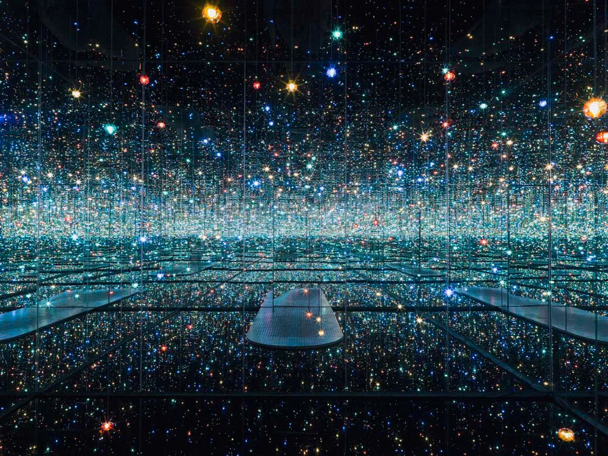
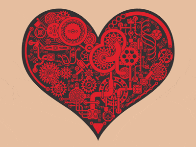
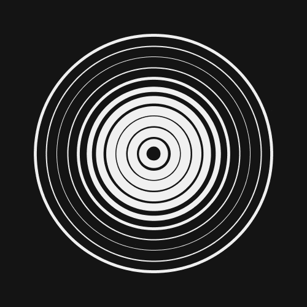
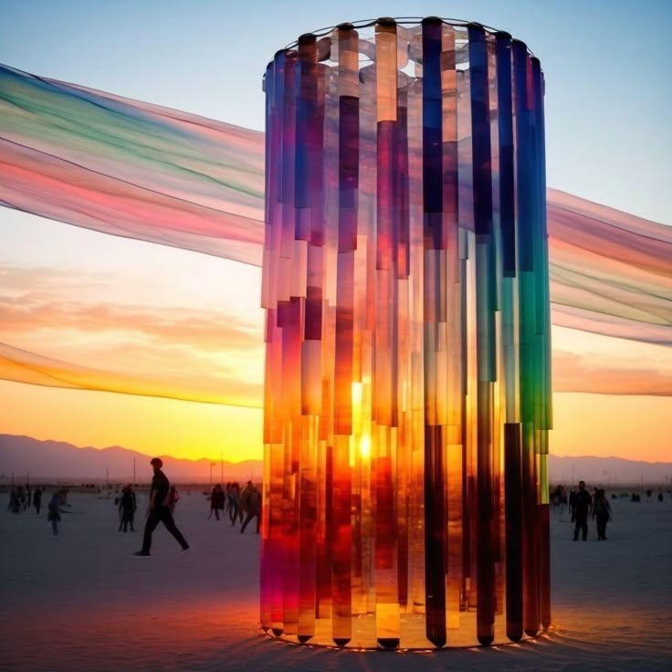

# 9103-lwen0943-major project

## Instructions on how to interact with the work
### After loading the page, the animation starts automatically. The dot rings begin to pulse with a breathing rhythm, and each dot’s colour shifts gradually between lighter and darker tones. Chain links also slowly shift colour every second. The motion is entirely time-driven, producing a meditative, evolving effect that unfolds continuously without user input.

---

## Details of my individual approach to animating the group code  
- **I chose Time as the method to drive my individual code.**

---

- **The properties that are animated and how they are animated**
  - I focused on the 'DotRing' class. I introduced a “breathing” animation where each concentric ring of dots expands and contracts slightly over time. This is achieved using a sine wave based on 'frameCount', giving a rhythmic pulse from the innermost to the outermost rings.
  - In addition to movement, I modified each dot’s colour brightness based on its breathing state. The colour brightness oscillates from light to dark and back, creating a synchronised visual pulse using HSB colour mode.
  - Each ring has a slight offset in its breathing cycle ('+i' phase shift), creating a ripple-like effect across all rings rather than uniform pulsing. This gives the illusion of structural movement reminiscent of mechanical rotation, but remains entirely breathing-based.
  - I also modified the 'ChainLink' class to update its colour once every second (based on 'frameCount'), giving a slow, non-repetitive glowing effect to each link. Each chain’s timing is independent, resulting in an organic unsynchronised rhythm.

---

- **References to inspiration for animation**
###  

### 
- My animation creation was deeply inspired by Yayoi Kusama's ‘Infinity Mirror Room — Souls from a Million Light Years Away’ (2013). The layered points of light and endless reflections in the work evoke the feeling of starlight twinkling. It's as if the points of light are breathing.
###  

### 
- This GIF is the most direct inspiration from the concentric circles. The pulsating rhythm, akin to breathing, accompanies the movement of the gears of time.
###  

### 
- This GIF was also inspired by ‘Infinity Mirror Room,’ where the pulsating motion was found through association, and the changes in brightness were used to represent the rhythm. It has a slow-motion effect reminiscent of starlight.
###  

### 
- This image is an installation art piece I saw earlier. It generates different colours of light based on the angle of sunlight at every moment, which also inspired the colour-changing chain. The chain's endpoints and centre resemble glass columns. As time changes, the colours reflect on the chain. 

---

## Technical explanation of my individual code

- In 'class DotRing', I used a 'pulse = sin(frameCount * 0.05 + i) * 2' function to control the radius of each ring dynamically. This creates a breathing-like expansion and contraction of the ring over time.
- I extracted the hue, saturation, and brightness values of the original colour using 'hue()', 'saturation()', and 'brightness()' in HSB mode. I then adjusted the brightness value using the pulse value to shift between light and dark. This keeps the original colour identity while allowing the tone to animate over time.
- The brightness is controlled using:  
  'const dynamicB = constrain(b + pulse * 5, 0, 100);'  
  This allows colour brightness to breathe in sync with the dot movement.
- In 'class ChainLink', I added a timer using 'frameCount' to track when each chain link last updated its colour. Every 60 frames (~1 second), a new random RGB colour is generated using 'getRandomChainColor()'. Each chain is updated independently, creating a soft, shifting colour variation without flashing.

---

## Explanation of changes made to group code

- I did not modify the original settings or drawing structure provided by the group. My changes were limited to the 'DotRing' and 'ChainLink' classes.
- I retained the visual style and structure of the group's work, adding animations to complement the original design rather than disrupt its integrity.
- My design is based entirely on time- and rhythm-driven animation logic.

---

## External tools or techniques used

- The code I used is derived from classroom content and extracurricular learning to deepen my understanding.
- I utilised the 'colorMode(HSB)' function and the 'hue()', 'saturation()', and 'brightness()' functions from the p5.js documentation to achieve brightness-based colour transitions.
  > p5.js HSB reference: https://p5js.org/reference/#/p5/colorMode
  > YouTube Reference: https://www.youtube.com/watch?v=lPgscmgxcH0
- I understood the role of frameCount in time-based animations. It demonstrated how to use frame-based conditions to trigger visual changes at fixed intervals.  
  > YouTube Reference: https://www.youtube.com/watch?v=B-N-isc31Z0
- Through this video, I learned how to use the sin() function to create smooth oscillating motion that changes over time. It helped me conceptualise the breathing animation for the point loop.  
  > YouTube reference: https://www.youtube.com/watch?v=YULQUdTSVkQ